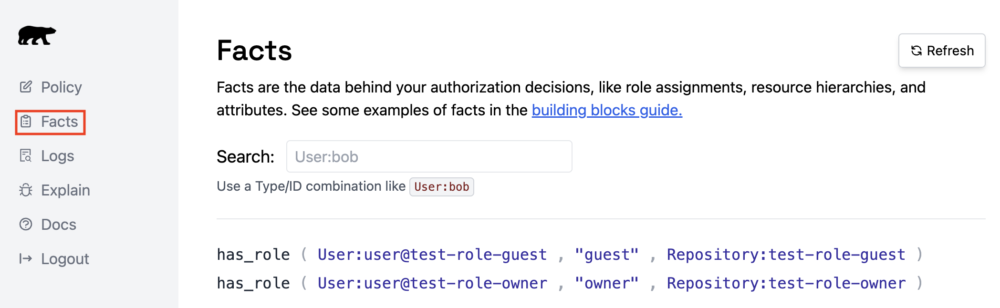
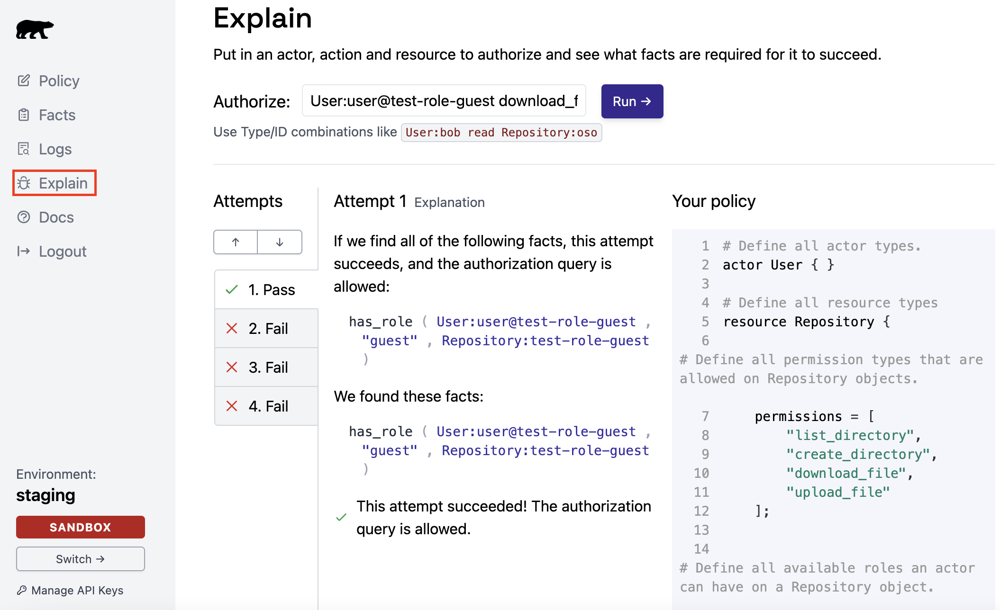

# Oso Cloud Authorization within a Repository REST API
**Prerequisites**
- Obtain an Oso Cloud API key ([Oso Cloud Docs: *Quickstart*](https://cloud-docs.osohq.com/get-started/quickstart))
- Install the `oso-cloud` python package ([Oso Cloud Docs: *Python API*](https://cloud-docs.osohq.com/reference/client-apis/python))


<br>
This application tutorial will guide you through how Oso Cloud can be used within backend REST APIs. We will first develop an authorization policy that models the actions users can perform with the APIs. Once the policy is complete, an `Oso` client will be used to enforce the authorization policies within the application itself.

REST APIs exist for different types of applications and services. Here, we model a set of REST APIs for gaining access to a file repository. You can imagine a simple file store that allows a client to:
- create a new repository,
- create directories in that repository,
- list directories on the repository,
- upload files to the repository and its directories, and
- download files from the repository and its directories.

However, access to these features should only be available to users who have been granted permission to do so, like the owner of the repository for example. This is where Oso Cloud steps in! Follow along with this tutorial and application code to see how it's done.

## Authorization Modeling with Oso Cloud
When building applications with authorization there are 3 steps that I like to follow first:
1. define the *access control model* that best fits my use case and authorization goals.
1. enumerate the *actors*, *resources*, *roles*, and *permissions* that are part of the application or service I am creating.
1. define the permissions that each role has.

### Defining the Access Model
The first step is geared towards understanding what parts of the application will be providing *data* needed to construct authorization decisions. In Oso Cloud, these data are known as your *facts*. To help generate facts, this application uses a Role Based Access Control (RBAC) model. With a RBAC model, information about what role a user has is needed for checking and populating authorization databases.

> **_NOTE_**: Other types of models could also be considered, for example, a Relationship-Based Access Control (ReBAC) model. A ReBAC model will not care about a user's role, but rather, a user-to-user connection or perhaps a user-to-resource. How data is extracted from the application, or other sources of truth (such as databases), is important and it will influence the abstractions you make in the next step.

### Enumerating Elements of Our Model
Since we have identified RBAC as our best fitting access control model, we can start thinking about:
- **WHO** will the interacting with our system (our `actors`)
- **WHAT** objects users can interact with (our `resources`)
- the **ACTIONS** that users can perform (our `permissions`)
- and the **GROUPS OF ACTIONS** that comprise the `roles` users can have within the system.

> **_NOTE_**: Our simple application makes this stage seem trivial, however, in more complicated systems, this enumeration step is important in accurately modeling your environment. So it's ok to spend a little time here to get it right!

#### Actor and Resource Enumeration
Let's tackle this list in the order listed above. In our application *user* is a good description of **WHO** will be accessing our system. We expect a user `jane@<my_org>.net` to use our system to manage a repo. In the Polar policy we then use the `actor` block to define a *type* `User`:
```Polar
# Define all actor types.
actor User { }
```

Next we define **WHAT** a `User` of our system will interact with. This is created in a similar fashion using the `resource` block:
```Polar
# Define all resource types
resource Repository {
    ...
}
```
Because our application provides access and controls for managing a file repository, we have chosen the name `Repository` for the type defined by our `resource` block.

We have now enumerated all of the object types that are used to model our application. Each *type* category within our model, **WHO** and **WHAT**, have one defined type: `User` and `Repository` respectively. Should our application become more complex, we can add more types of `actors` and `resources` to capture all the elements that comprise our system.

#### Role and Permission Enumeration
Roles and permissions apply to defined resources. In our case we have defined one `resource` type: `Repository`. Enumerating the roles and permissions for what specific users can do within a repository is key to the application design, how it operates as a service to clients, and how Oso Cloud will help enforce the desired authorization behavior.

In the previous section we defined an empty `resource` type: `Repository`. Now we will populate it with the permissions that represent what a `User` can do with our repository.
```Polar
resource Repository {
    # Define all permission types that are allowed on Repository objects.
    permissions = [
        "list_directories",
        "create_directory",
        "download_file",
        "upload_file"
    ];
    ...
}
```
As advertised in the beginning of the tutorial, our API will allow users to perform four key actions on the repositories they create. In our policy file, each of those actions described in the table below, is defined in the `permissions` list.

| Repository Permission | Description of Action |
|-----------------------|-----------------------|
| `list_directories` | A user with this permission will be able to list directories in the repository.|
| `create_directory` | A user with this permission will be able to create directories in the repository. |
| `download_file` | A user with this permission will be able to download files from the repository. |
| `upload_file` | A user with this permission will be able to upload files onto the repository. |


It would be sufficient to simply have a list of permitted actions, however, in many cases, that does not fully model the way authorization is granted in real world applications. That's why in addition to the permissions, we have also defined a set of roles. In the *Repository Roles* table, we see how permissions are now grouped. So rather than assigning individual permissions to a user, we can now define a set of actions associated with a role, and grant that role to *users* of *repositories*!

| Repository Role | Associated Repository Permissions |
|-----------------|-----------------------------------|
| `guest` | [`list_directories`, `download_file`] |
| `admin` | [`list_directories`, `download_file`, `create_directory`, `upload_file`] |
| `owner` | [`list_directories`, `download_file`, `create_directory`, `upload_file`] |

The Polar syntax to implement the associations referenced in the *Repository Roles* table. We simply add this code below the `permissions` definition.

```Ruby
resource Repository {
    ...

    # Define all available roles an actor can have on a Repository object.
    roles = ["owner", "admin", "guest"];

    # Define all permission/role assignments.
    "list_directories" if "guest";
    "download_file" if "guest";

    "list_directories" if "admin";
    "create_directory" if "admin";
    "download_file" if "admin";
    "upload_file" if "admin";

    # An "owner" has ALL "admin" roles.
    "admin" if "owner";
}
```
> **_NOTE_**: We can inherit permissions from other roles by creating a conditional rule using the `if` keyword. In the above policy, ALL `admin` permissions are granted to a user `if` they are an `owner`.  This avoids having to duplicate rules while still allowing use to fully model our environment.

Within the project folder you'll find the complete logic describing the authorization policy in `./policy.polar`. The policy represents the complete view of the model that we discussed in this section.


## Application Development
Oso Cloud is built on the idea that authorization logic should be separate from the application code. Our application follows that principle and thus, we have two main components:
1. the authorization policy written in the Polar language
1. the REST APIs and tests that use the policy for authorization enforcement.

We have already discussed creating the authorization rules in the previous section, so now we will see how to structure our application to make use of it for authorization.

### Configuring the Oso Cloud Client
The first step in our development process is configuring the `Oso` client. This is true for both our tests and application.

The `oso-cloud` package provides an interface for connecting to Oso Cloud. In order to make use of those interfaces, there are two thing you will need to do:
1. connect to Oso Cloud using your API key, and
1. load your authorization policy into Oso Cloud.

The code block below shows best practices for how simply this can be done.

```python
import os
import oso_cloud
...

_oso_client = None
###############################################################################
# Configure the Oso Client
###############################################################################
try:
#   1. Retrieve the api-key from the host machine to authenticate API usage
#      with Oso Cloud. The environment variable where the Oso API key is
#      stored is "OSO_AUTH".
    host_api_key = os.environ.get("OSO_AUTH")
    _oso_client = oso_cloud.Oso(
        url="https://cloud.osohq.com",
        api_key=host_api_key)
#   2. Load the Polar authorization policy into Oso Cloud.
    policy_file_name = "policy.polar"
    with open(policy_file_name) as policy_file:
        policy_string = policy_file.read()
        _oso_client.policy(policy=policy_string)
except Exception as e:
        print(e)
```
> **_NOTE_**: The API key stored in `OSO_AUTH` is retrieved dynamically rather than hardcoded into the application. In this example we use the `os.environ` object to get our API key. We highly recommend using *this* or a similar method to load API keys. This improves application security and greatly reduces the risk of exposing sensitive information to unintended audiences.

We begin with a call to `oso_cloud.Oso` and provide the required URL for connecting to Oso Cloud and validating the API key. The function returns an `Oso` class object
that is captured in `_oso_client`. Our first use of `_oso_client` is to upload our existing authorization policy into Oso Cloud. This will allow us to begin using Oso Cloud to evaluate information against our policy as soon as our application starts running.

These calls are run each time our application is launched to ensure that the most up-to-date policy is always available in Oso Cloud. Without an uploaded policy file populating facts and authorization decisions will fail. If a policy file should be come out of date and no longer model your application correctly, you may also result in errors or other types of unexpected behavior.

Take a look at `apis.py` to see how this code block is used within an application.

### Updating Authorization Facts Data
Finally, we are ready to inspect our first use of the `Oso` client within our app: *telling Oso Cloud what data it must use when evaluating authorization requests.*

This application demonstrates a scenario in which authorization data (*Oso facts*) are populated into Oso Cloud at the time of creation. An alternative scenario would be populating *facts* from a database or some other static entity. In either case, the way we use the `Oso` client is the same.

In the API request, `/create-repo`, a user is able to create a new repository by providing a username and the name of the repository they wish to create. Because we are implementing a RBAC authorization model, we want to create a *fact* that uniquely captures the user, repository, and role the user has been given on that repository. To do so we write a rule with the predicate `has_role` and provide the parameters needed to establish the `fact`. An example from the application is given here:

```python
@_app.route("/create-repo", methods=['POST'])
def create_repo():
    username = request.json.get(ApiParameterKeys.USERNAME)
    repo_name = request.json.get(ApiParameterKeys.REPO_NAME)

    # Check that the required parameters have been provided in the HTTP request.
    ...

    response_json = None
    try:
        # Create an Oso fact for the actor:User/resource:Repository pair,
        # granting the role of "owner", to the User for the specified Repository.
        defined_role = RepositoryRoles.OWNER
        _oso_client.tell(
            "has_role",
            User(username),
            RepositoryRoles.OWNER,
            Repository(repo_name))
        # Create a new directory for the specified username/rep_name pair.
        ...
    except Exception as e:
        print(e)
        ...
    ...
```
Each fact that is created will be populated in your Oso Cloud account. The Oso Cloud Dashboard contains a [Facts Page](https://cloud.osohq.com/facts) that allows you to see all the facts in your account. More information about the Facts Page can be found in [Testing and Trouble Shooting](#testing-and-trouble-shooting) section of this tutorial.

### Enforcing Authorization Policies
Finally, we are ready to implement authorization within our application. Oso Cloud will use your policy and the facts already established to make authorization decisions and return the result to your application.

Each API route that implements an action a user can perform on our repository will have its authorization decision handled by the `Oso` client. We use the `authorize` function to determine if the API response will result in *success* or an *unauthorized error*. Let's take a look at the code sample taken from the `/list-directories` API route:

```python
@_app.route("/list-directories", methods=['GET'])
def list_directories():
    username = request.json.get(ApiParameterKeys.USERNAME)
    repo_name = request.json.get(ApiParameterKeys.REPO_NAME)
    directory_path = request.json.get(ApiParameterKeys.DIRECTORY_PATH)
    ...

    # Check that the required parameters have been provided in the HTTP request.
    ...

    response_json = None
    try:
        # Check Oso Cloud to ensure the specified User has permission to
        # list directories from the specified Repository object.
        if _oso_client.authorize(User(username),
                                 RepositoryPermissions.LIST_DIRECTORIES,
                                 Repository(repo_name)):
            # Generate the list of subdirectories to provide in the server response to the client.
            ...
        else:
            return make_response(None, HttpResponseCode.CLIENT_ERROR_RESPONSE_401_UNAUTHORIZED)
    except Exception as e:
        print(e)
        return make_response(None, HttpResponseCode.SERVER_ERROR_RESPONSE_500_INTERNAL_SERVER_ERROR)

    return make_response(response_json, HttpResponseCode.SUCCESSFUL_RESPONSE_200_OK)
```
From the example we see the parameters `authorize` requires in order to make the authorization decision:
- the **username**,
- the **action** that the user wants to perform, and
- the **repository** on which they want to perform that action.

These are all the pieces of information needed by the API to fulfill the request and calling `authorize` does not increase the amount of data sent to the API with or without authorization. However, with one function call to Oso Cloud, we are able to implement authorization within our API without any of the technical debt associated with enforcing the authorization policy ourselves!

## Testing and Resources
Testing and trouble shooting are an important part of any application development process. In this section we briefly introduce three tools available on Oso Cloud to help with the process of including authorization within your applications.

In addition to the repository API code, this tutorial also contains two test files located in the directory `./test`. The tests present scenarios that follow the same repository API model developed in this tutorial and use the same Oso policy file `policy.polar` as well.

| Test file | Description |
|-----------|-------------|
| `./tests/policytests.py` | A set of functional tests that add role based facts to Oso Cloud and test authorization queries regarding user actions on a given repository. |
| `./tests/apitests.py` | A set of functional tests that demonstrate client usage of the repository APIs contained in `./apis.py`. The API service must be running for the tests to complete successfully. |

### Writing Test Code
We can start testing our policy as soon as we have finished modeling it in our policy file: `policy.polar`. This is a great place to start, even before writing our application code, or integrating authorization into an existing application.

The tests in `./tests/policytests.py` are one way we can go about this. The file demonstrates the same basic mechanics we discussed in [Application Development](#application-development):
- configure the `Oso` client,
- use `tell` to add authorization data facts to Oso Cloud, and
- use `authorize` to enforce authorization within our application.

### Oso Cloud Resources
What we have not yet discussed is how you can use Oso Cloud to help visualize the data being created and test your policy within the browser.

1. quickly test this workflow by running `./tests/policytests.py`.
    ```shell
    > python3 ./tests/policytests.py
    ```

1. Next, log into https://cloud.osohq.com and navigate to the [Facts Page](https://cloud.osohq.com/facts). Running the python test will produce two facts as shown in the image:


1. Now that we have facts based on our current policy, navigate the the [Explain Page](https://cloud.osohq.com/explain). Enter a query to test in the "Authorize" command text box such as in this example:
    ```shell
    User:user@test-role-guest download_file Repository:test-role-guest
    ```
    

In step 3 we can already start testing our authorization queries without writing further code. This can be used to quickly determine if authorizations are working as intended.

Making use of the [Explain Page](https://cloud.osohq.com/explain) may not seem as powerful with only two facts populated as in this example. However, if our repository application were populated with thousands of users, determining what roles or permissions allowed a user to violate a particular authorization policy will become more difficult. What's also nice about testing the query in this fashion is that it:
- references specific facts that allow an authorization to "Pass" or "Fail, and
- it brings up the policy side-by-side so you can compare what was modeled with the actual result.

## Summary
Using Oso Cloud to build authorization into applications requires **six** key steps:
1. Login to Oso Cloud and obtain a valid API Key. Reference the [Oso Cloud Docs: *Quickstart*](https://cloud-docs.osohq.com/get-started/quickstart) guide for help if needed.
1. Install the `Oso` client package. For this tutorial we are using the python package. Instructions for installing the package is available on [Oso Cloud Docs: *Python API*](https://cloud-docs.osohq.com/reference/client-apis/python) page.
1. Model your authorization logic within your Oso policy file. Capture all **Actors**, **Resources**, **Actions**, and **Roles** that describe how your application works.
1. Configure the `Oso` client within your application. Make sure that it is placed in a section of your application that will be called during every launch or refresh of your application.
1. Populate Oso Cloud with facts coming from your application. In our RBAC model, this information was formed by calling the `Oso` client's `tell` command with the **user**, **role**, and **repository** being associated with the user and role.
1. Add the authorization enforcement within your application by calling `authorize` from the `Oso` client. The authorize commands should map to places in your application serving the actions defined in the `resource` block's `permissions`.

We used an example of building a repository application REST API in python to demonstrate exactly how this process translates to a working application.

During the application development, we also saw how the authorization logic is completely separate from the application code itself. This is a great benefit not only during development, but also in testing since we can trouble shoot our authorization logic independently.